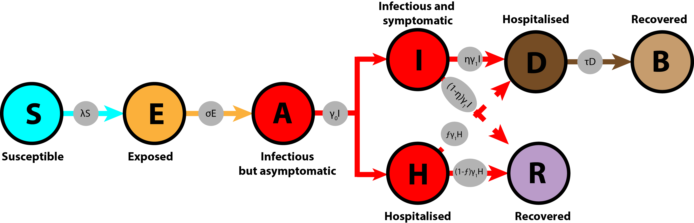

## Ebola Model:
 

The model above is derived from [Moss, R., Hickson, R. I., McVernon, J., McCaw, J. M., Hort, K., Black, J., ... & Geard, N. (2016). Model-informed risk assessment and decision making for an emerging infectious disease in the Asia-Pacific region. PLoS neglected tropical diseases, 10(9), e0005018.](https://journals.plos.org/plosntds/article?id=10.1371/journal.pntd.0005018). We incorporated available data on
- Air flight
- Mortality rate
- Country's population

and assumed varied hospital capacity for each country.